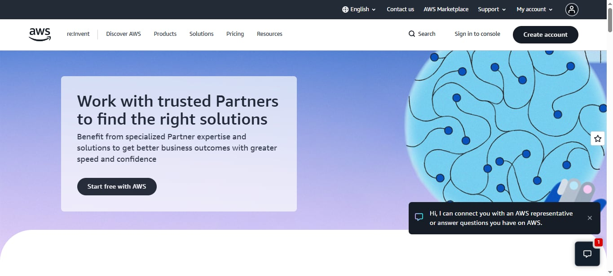
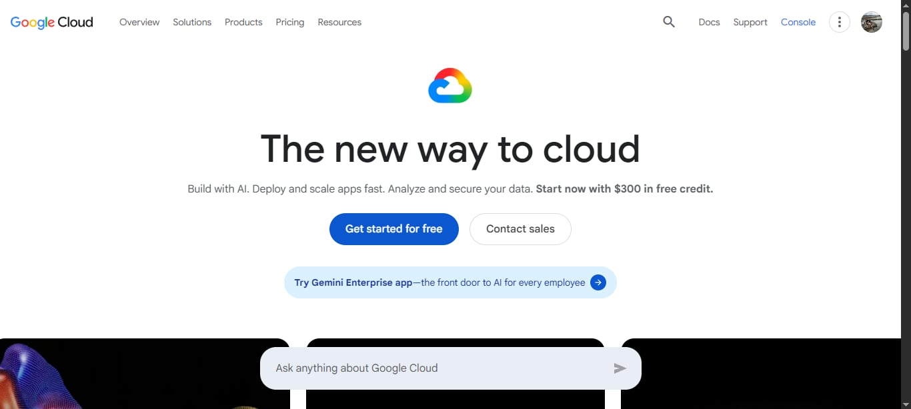
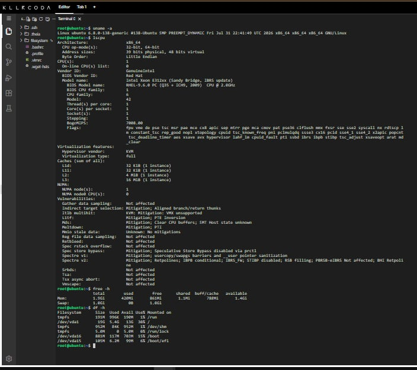
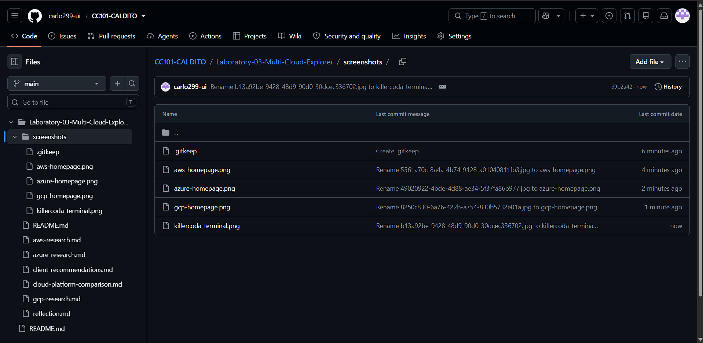

# Laboratory 03 – Multi-Cloud Explorer

## CCM101 – Cloud Computing

**Mission 3: Become a Multi-Cloud Explorer**

---

## Mission Overview

This laboratory activity focuses on exploring and comparing three major cloud computing platforms: Amazon Web Services (AWS), Microsoft Azure, and Google Cloud Platform (GCP).

The goal of this activity is to understand the major services offered by each cloud provider and determine which platform is most appropriate for different business requirements. As part of the activity, I also continued my Linux investigation using KillerCoda and connected the Linux environment to possible cloud virtual machine services.

---

## Objectives

After completing this laboratory activity, I was able to:

* Explore AWS, Microsoft Azure, and Google Cloud Platform.
* Identify important cloud services from each provider.
* Compare equivalent services between cloud providers.
* Analyze different business requirements.
* Recommend an appropriate cloud provider for different scenarios.
* Use Markdown for technical documentation.
* Continue developing my GitHub Cloud Computing Portfolio.
* Relate Linux server resources to cloud computing services.

---

## Cloud Platforms Explored

The three cloud platforms investigated in this laboratory were:

1. **Amazon Web Services (AWS)**
2. **Microsoft Azure**
3. **Google Cloud Platform (GCP)**

Each platform provides services for computing, storage, networking, databases, security, artificial intelligence, containers, and application development.

---

## Linux Investigation

For Checkpoint 7, I launched a KillerCoda Playground and used Linux commands to identify the operating system, CPU, memory, and disk space of the server.

### Commands Used

```bash
uname -a
```

Used to display information about the Linux operating system.

```bash
lscpu
```

Used to display CPU information.

```bash
free -h
```

Used to display memory information in a human-readable format.

```bash
df -h
```

Used to display available and used disk space.

---

## My Linux Server Information

### Operating System

**Actual result from KillerCoda:**

> Replace this section with the output from `uname -a`.

Example:

```text
Linux killercoda 5.x.x-generic x86_64 GNU/Linux
```

### CPU Information

**Actual result from KillerCoda:**

> Replace this section with the relevant output from `lscpu`.

### Memory

**Actual result from KillerCoda:**

> Replace this section with the output from `free -h`.

### Disk Space

**Actual result from KillerCoda:**

> Replace this section with the output from `df -h`.

---

## Possible Cloud Services for the Linux Server

If this Linux server were migrated to the cloud, it could be hosted using virtual machine services from the three cloud providers.

| Cloud Provider  | Virtual Machine Service |
| --------------- | ----------------------- |
| AWS             | Amazon EC2              |
| Microsoft Azure | Azure Virtual Machines  |
| Google Cloud    | Compute Engine          |

Amazon EC2 provides scalable virtual computing capacity. Azure Virtual Machines provides configurable virtual machines for running applications and workloads. Google Compute Engine provides virtual machines that can be configured with different CPU, memory, disk, and networking options.

---

## Screenshots

The following screenshots should be placed inside the `screenshots` folder:

* `aws-homepage.png`
* `azure-homepage.png`
* `gcp-homepage.png`
* `killercoda-terminal.png`
* `github-repository.png`

### AWS Screenshot



### Azure Screenshot


### Google Cloud Screenshot



### KillerCoda Terminal Screenshot



### GitHub Repository Screenshot



---

## Conclusion

This laboratory helped me understand that cloud providers offer many similar services but have different strengths. AWS has a very broad range of services, Azure is especially suitable for organizations already using Microsoft technologies, and Google Cloud is strong in data analytics, artificial intelligence, and Kubernetes.

The activity also showed me that choosing a cloud provider should depend on the actual requirements of an organization instead of simply choosing the most popular provider.

