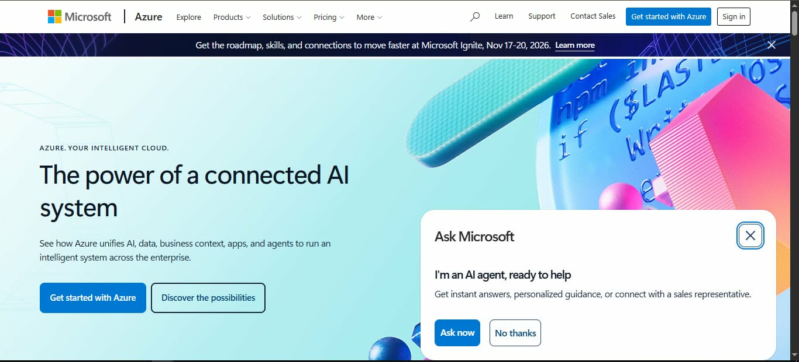

# Microsoft Azure Research

## Microsoft Azure

### 1. Brief Overview

Microsoft Azure is Microsoft's cloud computing platform. It provides services for computing, storage, networking, databases, artificial intelligence, analytics, security, application development, and hybrid cloud environments.

Azure is commonly used by organizations that already depend on Microsoft technologies because it can integrate with products and services in the Microsoft ecosystem.

---

## 2. Global Infrastructure

Azure has a large worldwide infrastructure designed to support applications with global availability, performance, data residency, and compliance requirements.

Microsoft currently describes Azure as having **80+ regions and 500+ datacenters**. Azure geographies contain one or more regions and are designed to help organizations meet data residency and compliance requirements.

This global infrastructure allows organizations to choose locations appropriate for their users and business requirements.

---

## 3. Cloud Management Console

The **Azure portal** is a web-based management interface used to create, manage, and monitor Azure resources.

Users can manage virtual machines, databases, applications, storage, networking, and other resources through the portal. The portal also provides dashboards, search tools, resource menus, Cloud Shell, notifications, and monitoring features.

The portal can be accessed using a supported web browser.

---

## 4. Four Core Services

### 4.1 Azure Virtual Machines

Azure Virtual Machines provide configurable virtual servers that can run Windows or Linux operating systems.

They can be used for:

* Application servers
* Web servers
* Development environments
* Enterprise workloads

---

### 4.2 Azure Blob Storage

Azure Blob Storage is an object storage service designed for storing large amounts of unstructured data.

Possible uses include:

* Documents
* Images
* Videos
* Backups
* Application data

---

### 4.3 Azure SQL Database

Azure SQL Database is a managed relational database service based on Microsoft SQL technologies.

It can be useful for applications that require relational database functionality without requiring the organization to manage all database infrastructure directly.

---

### 4.4 Microsoft Entra ID

Microsoft Entra ID provides identity and access management capabilities.

It can be used to manage users, applications, identities, and access to cloud resources and services.

---

## 5. Three Advantages

### 1. Strong Microsoft Integration

Azure is an especially suitable option for organizations that already use Microsoft technologies such as Windows Server, Microsoft 365, Active Directory, and SQL Server.

### 2. Hybrid Cloud Capabilities

Azure provides tools and services that allow organizations to connect on-premises environments with cloud resources.

### 3. Global Infrastructure

Azure provides a large worldwide infrastructure with many regions and datacenters. This can help organizations meet availability, latency, and data residency requirements.

---

## 6. Typical Enterprise Use Cases

Azure can be used for:

* Windows Server workloads
* Enterprise applications
* Microsoft 365-related environments
* Database hosting
* Web applications
* Hybrid cloud environments
* Artificial intelligence
* Data analytics
* Virtual desktops
* Application development

---

## Screenshot Evidence

Place an official Azure homepage or Azure portal screenshot in the screenshots folder.

**Filename:**

```text
azure-homepage.png
```

Example:

```markdown

```

---

## Conclusion

Microsoft Azure is a strong cloud platform for enterprises, especially organizations that already use Microsoft technologies. Its integration with Microsoft services, hybrid cloud capabilities, global infrastructure, and enterprise-oriented tools make it an appropriate choice for many organizations.

